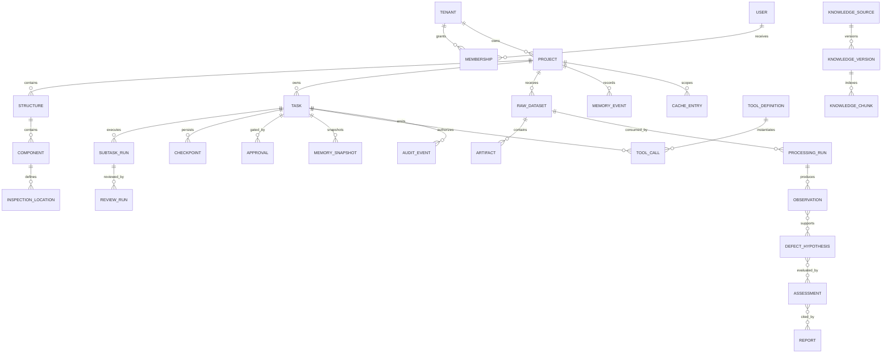

# Inspection Business Data Model

**Control ID:** DATA-MODEL-1.0  
**Task:** S0-03  
**Machine-readable dictionary:** [data-dictionary.v1.json](../../domain/data-dictionary.v1.json)

## 1. Modeling conventions

- Primary IDs are UUIDs serialized as lowercase strings at API boundaries.
- Every persisted row contains `schema_version`, `created_at`, and `created_by` unless it is a pure junction row.
- Every tenant-owned row contains `tenant_id`; project-owned rows also contain `project_id`.
- Timestamps are UTC instants. Display timezone is a client concern.
- Physical values store numeric value, canonical unit code, original unit, uncertainty when known, and conversion provenance.
- Immutable evidence is append-only. Correction creates a new version with `supersedes_id`.
- Authorization is enforced by PostgreSQL RLS and application policy; foreign keys do not replace scope checks.
- Large binary and derived data live in artifact storage; database rows store metadata, hashes, scope, and immutable references.

## 2. Aggregate map



## 3. Entity groups

### 3.1 Identity and scope

| Entity | Purpose | Important fields |
|---|---|---|
| `tenant` | top business isolation boundary | `tenant_id`, `code`, `status`, `policy_version` |
| `user` | human or service identity | `user_id`, `issuer`, `subject`, `status` |
| `membership` | scoped role assignment | `tenant_id`, optional `project_id`, `user_id`, `role_code`, `permission_version`, validity interval |
| `project` | project isolation and policy boundary | `project_id`, `tenant_id`, `code`, `status`, `region`, `policy_version` |

### 3.2 Civil-structure domain

| Entity | Purpose | Important fields |
|---|---|---|
| `structure` | inspected structure | `structure_id`, class code, lifecycle state, location, ontology version |
| `component` | generic component tree node | `component_id`, `structure_id`, parent ID, role code, geometry artifact |
| `inspection_location` | versioned point, line, area, or volume | `location_id`, `component_id`, geometry, coordinate reference, version |
| `raw_dataset` | immutable acquisition package | `dataset_id`, method code, instrument, calibration, operator, acquisition time, manifest hash |
| `processing_run` | one deterministic or model processing execution | `run_id`, adapter, parser, algorithm/model versions, parameters hash, input/output hashes, status |
| `observation` | normalized immutable measurement or fact | `observation_id`, type, value, unit, uncertainty, evidence, quality flags |
| `defect_hypothesis` | interpretation of observations | `hypothesis_id`, damage family, confidence, alternatives, limitations |
| `assessment` | reviewed condition evaluation | `assessment_id`, criteria, standard clauses, severity, urgency, eligibility, review state |
| `report` | versioned plan or report artifact record | `report_id`, type, status, artifact hash, approval ID, revision, supersedes ID |

### 3.3 Agent runtime

| Entity | Purpose | Important fields |
|---|---|---|
| `task` | complete user-facing task state owned by Main Agent | `task_id`, class, goal hash, status, risk, budget policy, context manifest |
| `subtask_run` | isolated child execution | `run_id`, parent task, agent type/version, scoped context hash, budget, result status |
| `checkpoint` | recoverable graph state | `checkpoint_id`, graph/schema versions, state artifact, sequence, committed side effects |
| `review_run` | independent result review | `review_id`, target result/hash, reviewer version, decision, findings, correction count |
| `approval` | accountable human decision | `approval_id`, action, target type/version/hash, policy, actor, outcome, expiry |

### 3.4 Tools, evidence, and audit

| Entity | Purpose | Important fields |
|---|---|---|
| `tool_definition` | versioned registry entry | name/version, side-effect class, schemas, permission, budget, owner, status |
| `tool_call` | one validated execution | call ID, task/run, tool version, input/output hashes, idempotency key, typed result |
| `artifact` | immutable or versioned content reference | artifact ID, URI, media type, size, hashes, classification, retention, status |
| `audit_event` | immutable policy and action record | event ID, actor, action, target, scope, decision, hashes, time, outcome |
| `cache_entry` | scoped reusable result | cache class, full key hash, scope/version manifest, TTL, validation, provenance |

### 3.5 Memory and knowledge

| Entity | Purpose | Important fields |
|---|---|---|
| `memory_event` | append-only source for candidate memory | scope, source, content hash, confidence, sensitivity, approval state |
| `memory_snapshot` | recoverable task/session state | snapshot ID, parent, graph/schema versions, artifact manifest, protected fields |
| `knowledge_source` | registered source and rights record | source ID, rights, classification, owner, source hash, current status |
| `knowledge_version` | candidate or published normalized version | version ID, source, parser chain, content hash, status, reviewer, approval |
| `knowledge_chunk` | searchable versioned unit | chunk ID, knowledge version, location, text/artifact hash, embedding/index versions |

## 4. Critical traceability chain

Every formal conclusion must support this traversal without an unversioned edge:

```text
report revision and approval
  -> assessment and review
  -> defect hypothesis and contrary evidence
  -> observation
  -> processing run, parameters, algorithm or model
  -> raw dataset and source artifact hashes
  -> instrument, calibration, operator, location, and acquisition time
  -> applicable standard version and clause
```

Missing links set report eligibility to false. A generated narrative cannot repair missing evidence.

## 5. Lifecycle and immutability

| Object | Mutation rule | Deletion rule |
|---|---|---|
| raw dataset and source artifact | immutable after registration | cryptographic erasure only when policy permits and no hold exists |
| observation and audit event | append-only; supersede by reference | immutable audit retained; observation follows evidence policy |
| published knowledge | immutable version; replacement creates a new version | withdraw from retrieval; retain history |
| formal report | immutable released revision | retain or destroy only under approved records policy |
| task working state | optimistic update plus checkpoint | expire under policy after snapshot and audit retention |
| cache entry | replace or invalidate atomically | delete on TTL, revocation, or version invalidation |

## 6. Version rules

1. `schema_version` uses semantic versioning and is stored on public contracts and persisted aggregates.
2. A major change alters meaning, required scope, identity, or compatibility and requires an explicit migration and rollback plan.
3. A minor change adds backward-compatible fields or codes. Readers reject unknown required semantics but may ignore documented optional fields.
4. A patch change clarifies validation or fixes an implementation without changing persisted meaning.
5. Every migration records source version, target version, tool version, actor, start/end time, row/artifact counts, hashes, and rollback evidence.
6. API input rejects unknown fields by default. Versioned extension namespaces require registry approval.
7. Optimistic `row_version` protects mutable administrative and draft objects from lost updates.
8. Published artifacts and audit evidence are content-addressed and never rewritten by a schema migration.

## 7. Storage boundaries

- PostgreSQL stores identities, relationships, state metadata, policies, and transactional records.
- pgvector stores embeddings in rows scoped to tenant, project, corpus, document, and index version.
- Redis stores bounded cache, locks, rate limits, and queue metadata; it is not the system of record.
- S3-compatible storage holds raw input, processing artifacts, checkpoints, models where approved, and report files.
- OpenTelemetry exports correlated traces without raw secrets or unrestricted business content.

## 8. Required model checks

- All project entity definitions include tenant and project scope.
- All evidence entities declare mutability and content hashes.
- Approval references an exact target version and hash.
- Report, assessment, observation, processing, dataset, and standard references form a complete traceability path.
- No cache, snapshot, queue, or vector entity is unscoped.
- Every status enum has terminal, failed, and blocked behavior documented in its public contract.
